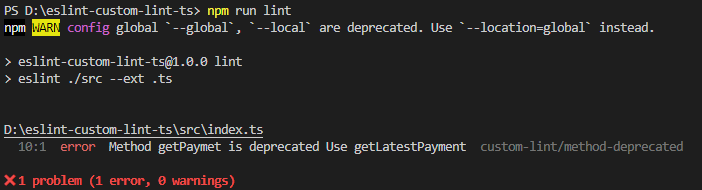

## Steps to add plugins in eslint

pre-requities - we should have typescript running with eslit 

NOTE - use https://astexplorer.net/ get Abstract Syntax Tree

1. Create eslintRules folder at root level

2. initilize node project inside eslintRules with name 'eslint-plugin-my-lint'. 

Note - to create custom plugin name of plugin look like [eslint-plugin-{pulgin_name_here}]

3. Create an index.js file inside the eslint directory.

4. write your own rule 

References - https://dev.to/devsmitra/how-to-create-a-custom-eslint-plugin-3bom

5. go back to your root folder of the project

6. Add  dependency in package.json 
    
        npm i file:packages/eslintrule -D

7. Update plugind and rules in .eslintric.js

        plugins:
            - 'custom-lint'
        
        rules:
            - custom-lint/method-deprecated: error

8. run eslint report

    

How to write global eslint rule to use across your project

Step1: Create you eslitn package such as [eslintRules](https://github.com/prem2033/eslint-custom-lint-ts/tree/master/eslintRules)

Step 2: add below code in index.js to use it as extended plugin

        module.exports.configs = {
            customConfig1: {
                rules: {
                    'custom-lint/method-deprecated': 'error',
                    'custom-lint/class-declaration': 'error',
                    'custom-lint/class-method-declaration': 'error',
                    'custom-lint/function-declaration': 'error',
                    'custom-lint/enum-validation': 'error',
                    'custom-lint/vars-declaration': 'error',
                    'custom-lint/interface-validator': 'error'
                }
            }
        }

Step 3: Publish the plugin to npm / link it to local repo

    to npm - npm publish
    to local - npm link

Step 4: now remove your custom rules from rules in .eslintrc.yml

Step 5: install you plugin/ Link your plugin

    npm install plugin_name
    npm link plugin_name

step 6:  add these thing to .eslintrc.yml

        extends:
            - plugin:custom-lint/customConfig1

